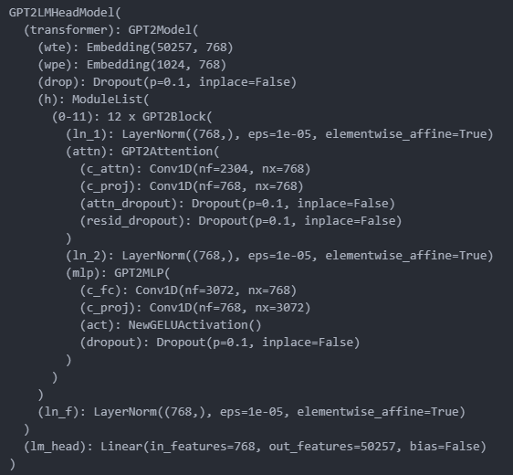
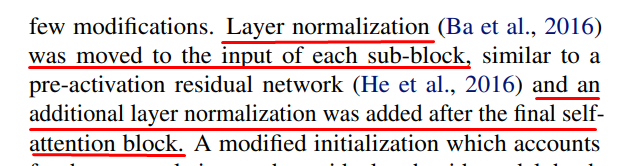

# GPT-2 From Scratch

## 🚀 About This Project

This project follows Andrej Karpathy’s tutorial ([Youtube Link](https://www.youtube.com/watch?v=l8pRSuU81PU)) and the paper [Language Models are Unsupervised Multitask Learners](https://cdn.openai.com/better-language-models/language_models_are_unsupervised_multitask_learners.pdf) on building the GPT-2 architecture from scratch.
If you want to see the original implementation is the latest model published openly from Open-AI and it is available on [Hugging Face](https://huggingface.co/openai-community/gpt2) and also the code can be found at their [OpenAI GPT-2 Repo](https://github.com/openai/gpt-2/tree/master/src).

Below you can see the model architecture as reported from pytorch:

You can clearly observe the following:

- Vocabulary Size = 50257
- Context length = 1024
- Embedding Size = 768
- Output head = Embedding Size → Vocabulary Size
- And the targeted Layer Normalization placements as described inside the paper

